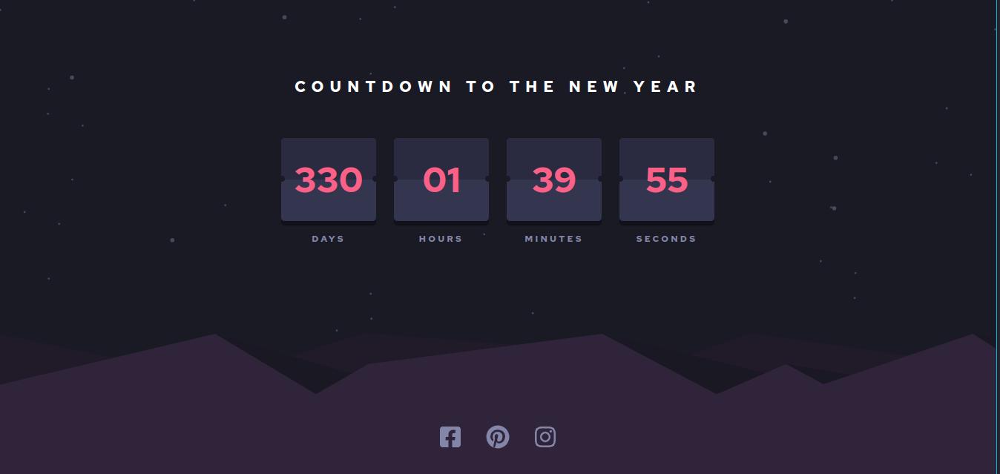

# Frontend Mentor - Launch countdown timer solution

This is a solution to the [Launch countdown timer challenge on Frontend Mentor](https://www.frontendmentor.io/challenges/launch-countdown-timer-N0XkGfyz-). Frontend Mentor challenges help you improve your coding skills by building realistic projects. 

## Table of contents

- [Overview](#overview)
  - [The challenge](#the-challenge)
  - [Screenshot](#screenshot)
  - [Links](#links)
- [My process](#my-process)
  - [Built with](#built-with)
  - [Continued development](#continued-development)
- [Author](#author)

## Overview

### The challenge

Users should be able to:

- See hover states for all interactive elements on the page
- See a live countdown timer that ticks down every second (start the count at 14 days)
- **Bonus**: When a number changes, make the card flip from the middle

### Screenshot

### Links

- Live Site URL: [Launch countdown timer](https://remy349.github.io/launch-countdown-timer/)

## My process

### Built with

- SCSS for styles
- Flexbox
- Mobile-first workflow
- [React](https://reactjs.org/) - JS library

### Continued development

- When a number changes, make the card flip from the middle

## Author

- Frontend Mentor - [@Remy349](https://www.frontendmentor.io/profile/Remy349)

### Developed by Santiago de Jesús Moraga Caldera - Remy349(GitHub)
